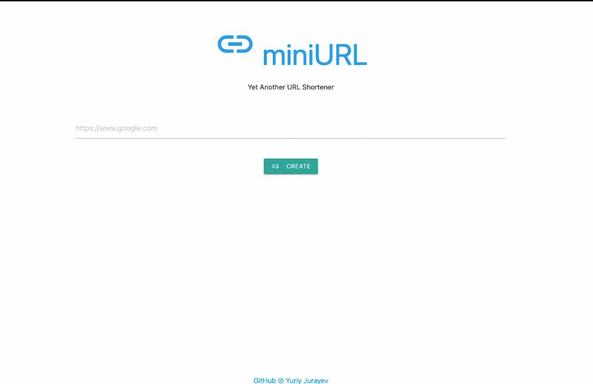
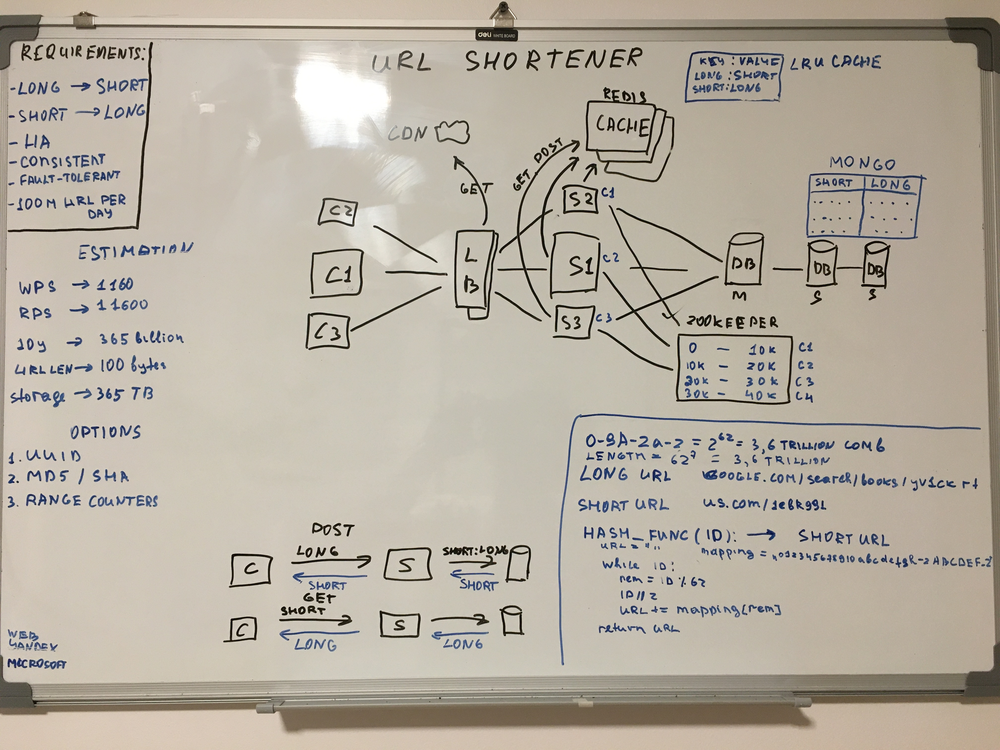

# miniURL

Yet Another Url Shortener. Takes user long url and reduces the length to 8 characters long + miniURL website domain.
```bash
long url: https://www.google.com/search?sxsrf=ALeKk02VZozex2ndqrxfu6U8OOe4jrwLfQ:1619024507825&q=Ridiculously+long+URL&sa=X&ved=2ahUKEwiOja-l6I_wAhXXFXcKHfoTDEoQ1QIwF3oECBoQAQ&biw=1920&bih=969
short url: https://mini-url.com/jBdhDixl
```

_Try it out now: https://mini-url-xyz.herokuapp.com_

**Note: it takes 1-2 mins to load the website for the first time, so be patient**

### Live Demo



## Architecture Diagram For Production


## Components
All backend code base follows [PEP8 style guidelines.](https://www.python.org/dev/peps/pep-0008)
### Front-End
* VanillaJS, Ajax, HTML/CSS
### Back-End 
* Python 3.9
* **FastApi** web framework
* **Redis** as key-value store database
* **PyTest** for testing
* **FakeRedis** for redis integration testing
### Local Development
* Docker
* Docker Compose

# Development
## Installing dependencies
- Python 3.x
- Pip
- Docker and Docker Compose

## Set required env variables
You need to provide a password for redis instance. Password can be generate with the following command:

`openssl rand -hex 32`

Set env variable:

`export REDIS_PASSWORD=<insert password here>`

## Running Application:
1. Starting application as simple as running this command:

`docker compose up`

Note: when running the first time ever, it takes a while to download all images.

2. Now, navigate to http://0.0.0.0:8000

3. Shutdown the app:

`docker compose down`

## Documentation
Documentation is available here:

1. Swagger UI: http://0.0.0.0:8000/docs
2. Redoc: http://0.0.0.0:8000/redoc

## Testing
Simply run:

`pytest`

## Contributing
Pull requests are welcome. For major changes, please open an issue first to discuss what you would like to change.

Please make sure to update tests as appropriate and follow the PEP8 style guide.

## License

The content of this repository is licensed under a [MIT License.](https://github.com/jurayev/mini-url/blob/main/LICENSE.md)
